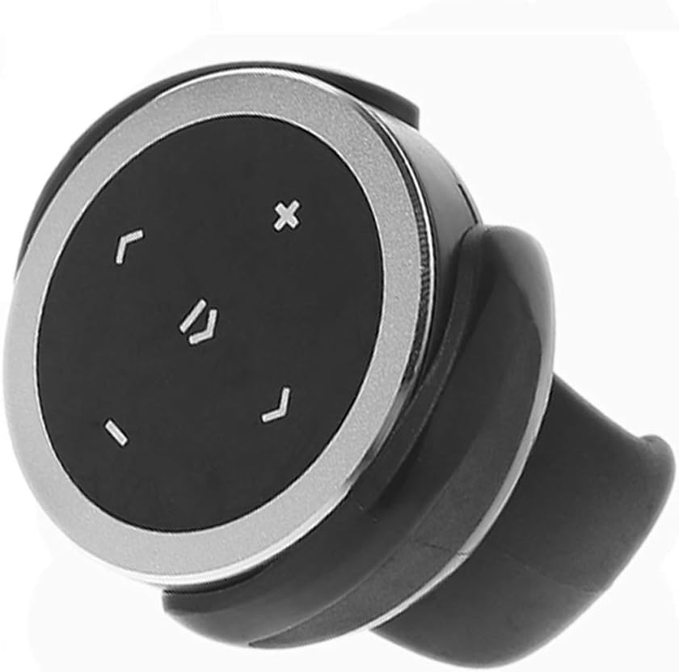

<div align="center">

  <h1>keypress-server</h1>
  
  <p>
    This python demo receives keypresses from a bluetooth remote connected to a Raspberry Pi and forwards those commands to a client via Socket IO. It has been specifically created to be the companion app to the MacOS Swift demo application SonosRemote: https://github.com/denisblondeau/SonosRemote


  </p>
  
<p>
  
  
  

</p>
</div>

## About the Project

This demo:

- Waits for specific keypresses received from a Bluetooth remote such as this one:



- In response to a keypress, sends the following commands to the client: Play/Pause, Previous Track, Next Track, Volume Up, Volume Down.

### Prerequisites

- Before building/running this application:

 - Set up a Raspberry Pi. For this demo, a headless Raspberry Pi 4 was used but other models should work.

 - Pair a bluetooth remote to the Raspberry Pi. Put the remote into pairing mode and from the pi console:
    - bluetoothctl
    - agent on
    - scan on
    - Once you find the remote in the list, use its address to trust, pair and connect to it:

      - trust 0A:EC:78:1A:19:5D
      - pair 0A:EC:78:1A:19:5D
      - connect 0A:EC:78:1A:19:5D
    - agent off
    - quit

- In your python environment, install (see requirements.txt):
  - aiohttp: https://pypi.org/project/aiohttp/
  - evdev: https://pypi.org/project/evdev/
  - python-socketio: https://pypi.org/project/python-socketio/


 - In main.py, before running the server, you need to set two variables:

```bash
  # Raspberry pi server name and port.
   sio = socketio.AsyncServer(cors_allowed_origins="ws://piservername.local:8080")

  # Path for bluetooth remote on this app's server.
	devPath = "/dev/input/event2"
```

- To figure out which event your bluetooth remote is connected to you can run the following once evdev is installed:

 ```bash
  $ python -m evdev.evtest
 ```
### Testing

*** Before launching the python server, make sure that your bluetooth remote is connected and that devPath is set to the correct event; otherwise, the application will hang. If everything is running correctly you will see the following in the console: 

```bash
  ======== Running on http://0.0.0.0:8080 ========
(Press CTRL+C to quit)
 ```

Your server is now ready to receive keypresses from the bluetooth remote and forward those keypresses to a client application.